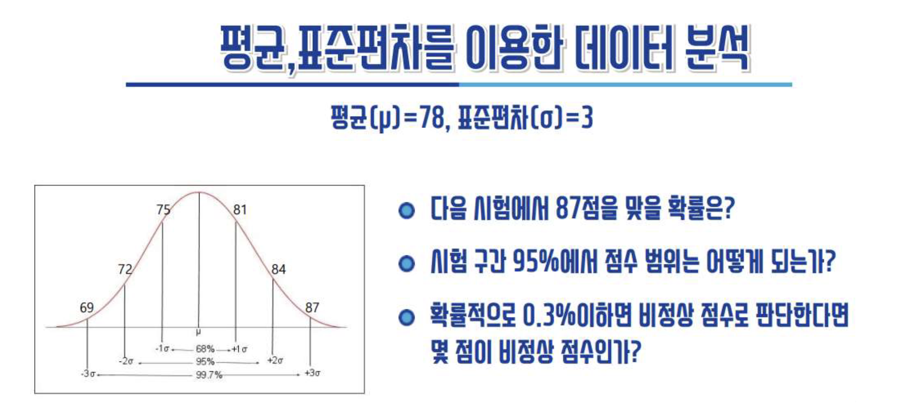
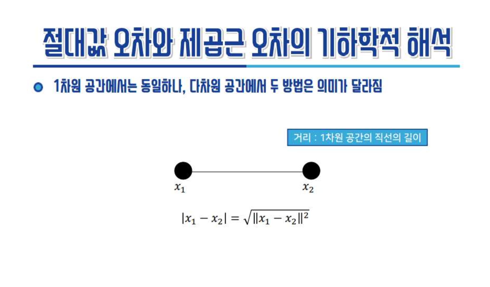
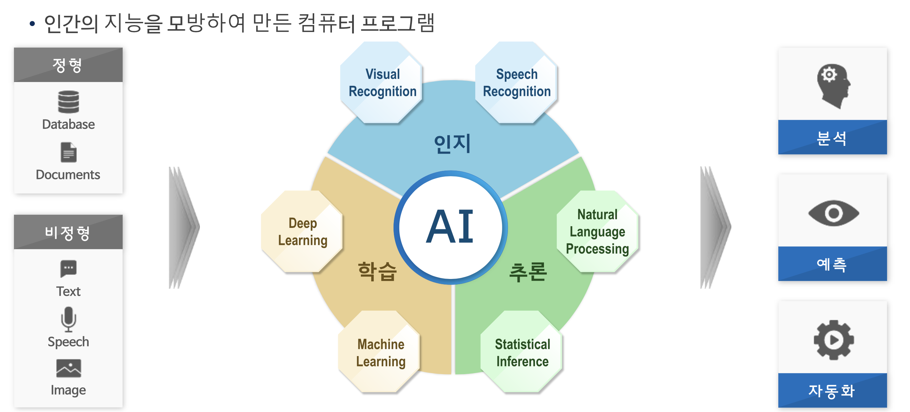
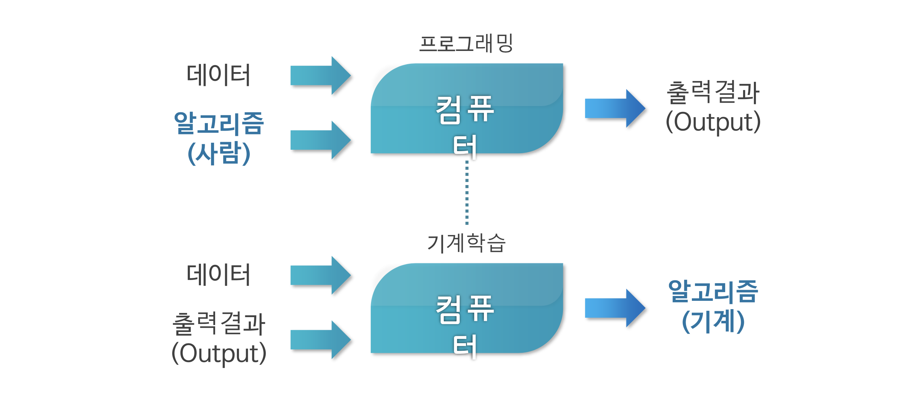
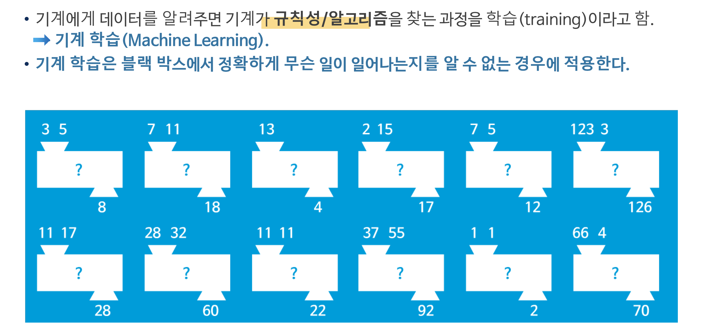
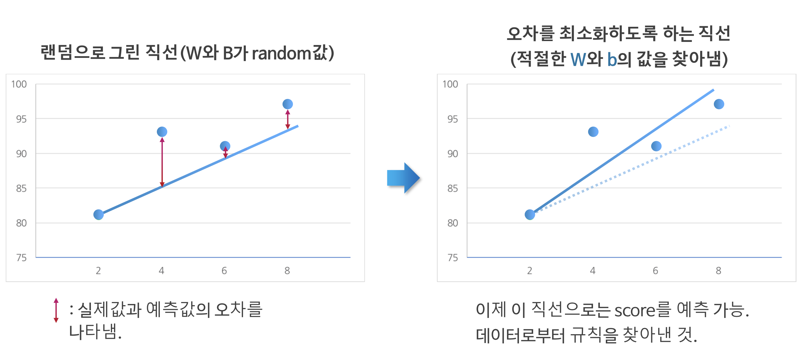
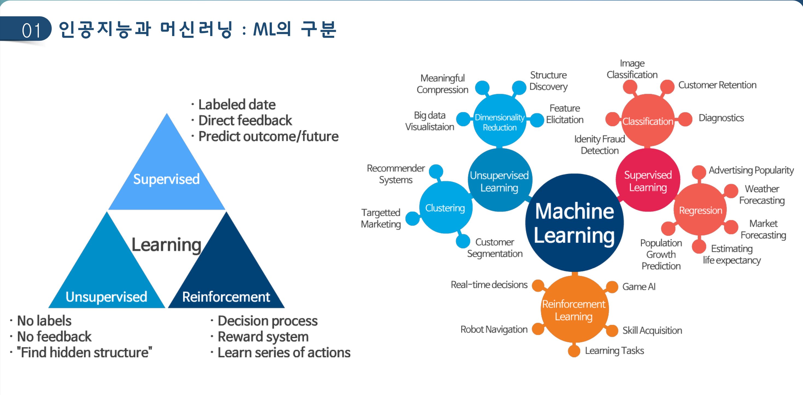

# AI를 이용한 금융보안 데이터 분석(기본) (2022 컨소시엄)
> git add --all; git commit -am readme; git push origin master
## 목차
- [AI를 이용한 금융보안 데이터 분석(기본) (2022 컨소시엄)](#ai를-이용한-금융보안-데이터-분석기본-2022-컨소시엄)
  - [목차](#목차)
  - [강사공유자료](#강사공유자료)
  - [Day 1 (8월 9일)](#day-1-8월-9일)
    - [2022 가트너 12대 전략 기술동향](#2022-가트너-12대-전략-기술동향)
    - [AI의 현재와 미래](#ai의-현재와-미래)
    - [AI에 다가가기](#ai에-다가가기)
    - [데이터학습(모델링)](#데이터학습모델링)
      - [학습모델 검증](#학습모델-검증)
        - [신경망 모델](#신경망-모델)
        - [의사결정나무(Decision Tree) 모델](#의사결정나무decision-tree-모델)
        - [딥러닝(Deep Learning) 모델](#딥러닝deep-learning-모델)
  - [Day 1 실습](#day-1-실습)
  - [Day 2 (8월 10일)](#day-2-8월-10일)
    - [인공지능의 개념](#인공지능의-개념)
    - [머신러닝의 접근방식](#머신러닝의-접근방식)
    - [기계학습의 직관적인 예제](#기계학습의-직관적인-예제)
    - [기계학습의 간단한 예 (최소 오차 직선의 방정식 찾기(y = wx + b))](#기계학습의-간단한-예-최소-오차-직선의-방정식-찾기y--wx--b)
    - [ML의 구분](#ml의-구분)
    - [머신러닝 기초이론](#머신러닝-기초이론)
      - [회귀분석, 로지스틱 회귀분석](#회귀분석-로지스틱-회귀분석)
  - [Day 2 실습](#day-2-실습)
## 강사공유자료
- [인공지능 공부 자료 모음 github](https://github.com/teddylee777/machine-learning)
- [딥러닝을 이용한 자연어처리](https://wikidocs.net/book/2155https://wikidocs.net/book/2155)
- [파이선 데이터 분석](https://datascienceschool.net/intro.html)

> 무언가를 공부할때 포트폴리오를 만든다는 생각으로 정리하고 공유하자.

## Day 1 (8월 9일)

### 2022 가트너 12대 전략 기술동향
1. 성장가속 부문: 제너레이티브(Generative) AI
   - 주어진 학습 데이터를 학습하여 학습데이터의 분포를 따르는 유사한 데이터를 생성하는 모델
2. 변화형성 부문: 의사결정 지능
    - 의사 결정을 최적화(Decision Optimization)하는 데 적용되는 AI, 최적화 모델링 등을 말한다. 비즈니스 자동화(business automation) 방식의 하나로, 비즈니스 규칙을 적용하여 조직에서 정의한 의사 결정 프로세스를 자동화하여 운영의 효율성을 향상시킨다
2. 변화형성 부문: 인공지능 엔지니어링
    - 데이터 수집/분석, 가공, 모델구현, 적용, 평가, 모니터링, 배포, 시각화 등의 자동화 최적화 기술

### AI의 현재와 미래
- [AI에게 벽돌깨기를 가르쳐봤다](https://www.youtube.com/watch?v=V1eYniJ0Rnk)
- 이미지추론(pdf.19), 챗봇, 번역, 창작(문학(pdf.23), 예술 작품), StarCraft2 (프로게이머 vs AI) ?
- [GuaGAN](https://www.nvidia.com/ko-kr/studio/canvas/)(pdf.26), [Youtube](https://www.youtube.com/watch?v=OGGjXG562WU&t=535s)
- [Magenta AI Jam](https://www.youtube.com/watch?v=QlVoR1jQrPk)

### AI에 다가가기 
- [PyTorch VS Tensorflow](https://news.hada.io/topic?id=5578)
- Tensorflow Developers Certificate(pdf.44)
- AI는 만능이 아니다. 데이터전문가, AI전문가가 되기 보다 실무의 전문가가 먼저되어야 AI를 실무에서 성공시킬수 있다.(pdf.52)
- 데이터 가공, 선별, **개발** 능력이 있어야 한다. 
- `도메인 전문가` + `개발능력`

### 데이터학습(모델링)
- 기계학습 및 딥러닝에서 학습은 학습 데이터를 가장 잘 설명할 수 있는 모델(수학공식 등)을 만들어 가는 과정
- 하지만 실세계의 문제는 철수 다음달 수학성적을 맞추는 것처럼 딱 떨어지는 공식을 적용하기 어렵다. 예측을 위해 평균, 표준편차를 사용한다.
  


#### 학습모델 검증
##### 신경망 모델
- 그래프(시각화)를 통해 정규분포 가설의 적합성을 판단하나 고차원 데이터의 경우는 시각화가 어려움
- 데이터기반 학습최적화. 오차 패널티(pdf.73)


- 유클리디안 거리(Euclidean distance)




> **쉬는시간 질문 (8/9 14:26)**<br>
> 수강생: 주식에 대한 AI 기술을 적용할때 종목에 대한 부정적 기사와 긍적적 기사를 어떻게 분류했는지?<br>
> 강사: 뉴스 기사를 라벨링 한다. 전통적으로 부정어휘, 긍정어휘로 판단한다. 라벨링 학습 모델링이 어렵다(주관적). <br>
> 전통적방식은 어휘사전 업데이트, 종목 유형(대기업, 중소기업, 테마 등)별 스코어링, 부정, 긍정, 가중치 설정등 세밀한(귀찮은) 작업이 필요하다. AI 라벨링 방식이 훨씬 관리비용 적고 정확하다.

- 행렬을 이용한 학습해 구하기(pdf.79)
- 역행렬을 이용한 최적해 구하기(pdf.80)
> GPU 가 연산을 하기 때문에 머신은 행렬 연산을 사용한다.


- 신경망 데이터 학습의 핵심 -> 직선(Linear)의 방정식으로 푼다.
- 비선형모델은 -> 고차원 변환을 통한 선형 모델링 
  - n차원을 (n-1)차원(기준평면)으로 자른다(변환, 재분류)
##### 의사결정나무(Decision Tree) 모델
##### 딥러닝(Deep Learning) 모델
- 입력층과 출력층 사이에 무수히 많은 은닉측이 있다. 그 무수히 많은 은닉층을 연결하는것이 직선의 방정식이다. 딥러닝 모델은 무수히 많은 직선의 방정식의 조합이다. 
- 레이어(은닉층)을 늘릴수록 판단이 정확해 진다. 과거에는 컴퓨팅 비용이 많이 들어 효용성이 없었다. 컴퓨팅 파워의 발전과 학습데이터의 폭발적 증가로 딥러닝의 실용화가 가능해 졌다.


## Day 1 실습
- Google Colaboratory 설정
- [day1_첫실습](colab/day1_%EC%B2%AB%EC%8B%A4%EC%8A%B5.ipynb)
- [day1_환경구축](colab/Day_1_01_Colaboratory_%ED%99%98%EA%B2%BD_%EA%B5%AC%EC%B6%95.ipynb)
- [day1_tensor_manipulation](colab/Day_1_02_tensor_manipulation.ipynb)

```js
// 행렬곱
M1 = [1,2]  
     [3,4]

M2 = [1]  
     [2]

// 1*1 + 2*2 = 5
// 3*1 + 4*2 = 11

MUL = [ 5]
      [11]
```

## Day 2 (8월 10일)
### 인공지능의 개념



### 머신러닝의 접근방식



### 기계학습의 직관적인 예제



### 기계학습의 간단한 예 (최소 오차 직선의 방정식 찾기(y = wx + b))
- 직선을 긋고 최소오차의 직선을 찾는다



### ML의 구분
- 지도 학습
  - 정답이 있는 데이터를 활용해 데이터를 학습시키는 것
  - 입력 값(X data)이 주어지면 입력값에 대한 Label(Y data)를 주어 학습
  - 사람이 라벨링을 하며 학습 비용이 높다. 학습량에 정비례.
  - 분류(Classification): 이산데이터화. 이거냐 저거냐
  - 회귀(Regression): 어떤 수나 실수로 예측(상대적으로 어려움)
- 비지도 학습
  - 정답 라벨이 없는 데이터를 비슷한 특징끼리 군집화 하여 새로운 데이터에 대한 결과를 예측
  - 데이터의 숨겨진 규칙을 찾는다. 라벨링, 피드백 안함. 그래서 대량의 데이터를 학습 시킬 수 있다.
- 강화 학습은 지도없이 머신에 보상을 제공하며 학습을 시킨다. 게임처럼.
> [참고블로그링크](https://ebbnflow.tistory.com/165)
- 준지도(Semi-supervised) 학습
   - 지도 학습을 (ex: gpt3) 을 통해 체계적인 데이터 학습 후에 비지도 학습으로 비정형데이터를 대량으로 쏟아부어 학습시킨다.


> 머신러닝 벤치마킹 사이트 8/10 13:09<br>
> [playground.tensorflow.org](https://playground.tensorflow.org/#activation=tanh&batchSize=10&dataset=circle&regDataset=reg-plane&learningRate=0.03&regularizationRate=0&noise=0&networkShape=4,2&seed=0.75216&showTestData=false&discretize=false&percTrainData=50&x=true&y=true&xTimesY=false&xSquared=false&ySquared=false&cosX=false&sinX=false&cosY=false&sinY=false&collectStats=false&problem=classification&initZero=false&hideText=false)<br>
> [ml-playground.com](https://ml-playground.com/#)

### 머신러닝 기초이론

#### 회귀분석, 로지스틱 회귀분석
- Gradient decent: 경사하강 알고리즘
  - W:= W - 학습률(a)* 미분:기우는상태:a/aW)*cost(W)


## Day 2 실습
- [Day_2_01_linear_regression](colab/Day_2_01_linear_regression.ipynb)