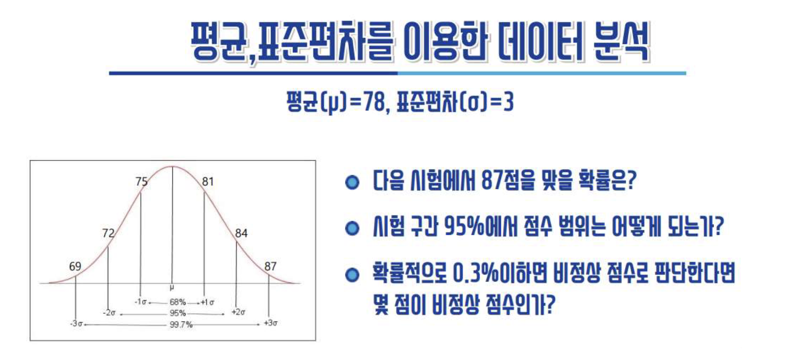
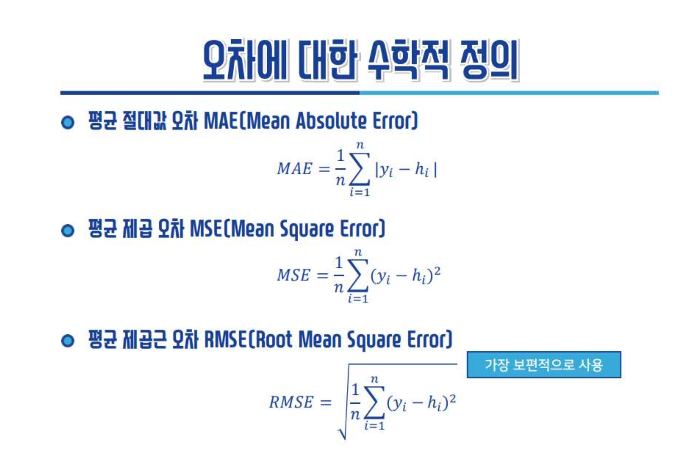
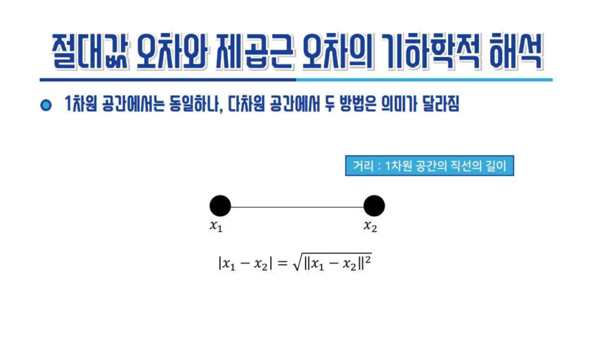

# AI를 이용한 금융보안 데이터 분석(기본) (2022 컨소시엄)

## 목차
  - [Day 1](#day-1)
    - [2022 가트너 12대 전략 기술동향](#2022-가트너-12대-전략-기술동향)
    - [AI의 현재와 미래](#ai의-현재와-미래)
    - [AI에 다가가기](#ai에-다가가기)

## 강사공유자료
- [인공지능 공부 자료 모음 github](https://github.com/teddylee777/machine-learning)
- [딥러닝을 이용한 자연어처리](https://wikidocs.net/book/2155https://wikidocs.net/book/2155)
- [파이선 데이터 분석](https://datascienceschool.net/intro.html)

> 무언가를 공부할때 포트폴리오를 만든다는 생각으로 정리하고 공유하자.

## Day 1 (8월 9일)

### 2022 가트너 12대 전략 기술동향
1. 성장가속 부문: 제너레이티브(Generative) AI
   - 주어진 학습 데이터를 학습하여 학습데이터의 분포를 따르는 유사한 데이터를 생성하는 모델
2. 변화형성 부문: 의사결정 지능
    - 의사 결정을 최적화(Decision Optimization)하는 데 적용되는 AI, 최적화 모델링 등을 말한다. 비즈니스 자동화(business automation) 방식의 하나로, 비즈니스 규칙을 적용하여 조직에서 정의한 의사 결정 프로세스를 자동화하여 운영의 효율성을 향상시킨다
2. 변화형성 부문: 인공지능 엔지니어링
    - 데이터 수집/분석, 가공, 모델구현, 적용, 평가, 모니터링, 배포, 시각화 등의 자동화 최적화 기술

### AI의 현재와 미래
- [AI에게 벽돌깨기를 가르쳐봤다](https://www.youtube.com/watch?v=V1eYniJ0Rnk)
- 이미지추론(pdf.19), 챗봇, 번역, 창작(문학(pdf.23), 예술 작품), StarCraft2 (프로게이머 vs AI) ?
- [GuaGAN](https://www.nvidia.com/ko-kr/studio/canvas/)(pdf.26), [Youtube](https://www.youtube.com/watch?v=OGGjXG562WU&t=535s)
- [Magenta AI Jam](https://www.youtube.com/watch?v=QlVoR1jQrPk)

### AI에 다가가기 
- [PyTorch VS Tensorflow](https://news.hada.io/topic?id=5578)
- Tensorflow Developers Certificate(pdf.44)
- AI는 만능이 아니다. 데이터전문가, AI전문가가 되기 보다 실무의 전문가가 먼저되어야 AI를 실무에서 성공시킬수 있다.(pdf.52)
- 데이터 가공, 선별, **개발** 능력이 있어야 한다. 
- `도메인 전문가` + `개발능력`

### 데이터학습개요
#### 데이터학습(모델링)
- 기계학습 및 딥러닝에서 학습은 학습 데이터를 가장 잘 설명할 수 있는 모델(수학공식 등)을 만들어 가는 과정
- 하지만 실세계의 문제는 철수 다음달 수학성적을 맞추는 것처럼 딱 떨어지는 공식을 적용하기 어렵다. 예측을 위해 평균, 표준편차를 사용한다.
  

#### 학습모델 검증
##### 신경망 모델
- 그래프(시각화)를 통해 정규분포 가설의 적합성을 판단하나 고차원 데이터의 경우는 시각화가 어려움
- 데이터기반 학습최적화. 오차 패널티(pdf.73)

- 유클리디안 거리(Euclidean distance)

> **쉬는시간 질문 (8/9 14:26)** 
> 수강생: 주식에 대한 AI 기술을 적용할때 종목에 대한 부정적 기사와 긍적적 기사를 어떻게 분류했는지? 
> 강사: 뉴스 기사를 라벨링 한다. 전통적으로 부정어휘, 긍정어휘로 판단한다. 라벨링 학습 모델링이 어렵다(주관적).  
> 전통적방식은 어휘사전 업데이트, 종목 유형(대기업, 중소기업, 테마 등)별 스코어링, 부정, 긍정, 가중치 설정등 세밀한(귀찮은) 작업이 필요하다. AI 라벨링 방식이 훨씬 관리비용 적고 정확하다.

- 행렬을 이용한 학습해 구하기(pdf.79)
- 역행렬을 이용한 최적해 구하기(pdf.80)
> GPU 가 연산을 하기 때문에 머신은 행렬 연산을 사용한다.

- 신경망 데이터 학습의 핵심 -> 직선(Linear)의 방정식으로 푼다.
- 비선형모델은 -> 고차원 변환을 통한 선형 모델링 
  - n차원을 (n-1)차원(guide line)으로 자른다(변환, 재분류)
##### 의사결정나무(Decision Tree) 모델
##### 딥러닝(Deep Learning) 모델
- 입력층과 출력층 사이에 무수히 많은 은닉측이 있다. 그 무수히 많은 은닉층을 연결하는것이 직선의 방정식이다. 딥러닝 모델은 무수히 많은 직선의 방정식의 조합이다. 
- 레이어(은닉층)을 늘릴수록 판단이 정확해 진다. 과거에는 컴퓨팅 비용이 많이 들어 효용성이 없었다. 컴퓨팅 파워의 발전과 학습데이터의 폭발적 증가로 딥러닝의 실용화가 가능해 졌다.